# Описание
Uplink — это платформа для соревнований по скоростному набору текста в реальном времени. Проект позволяет пользователям соревноваться друг с другом, отслеживать прогресс и улучшать навыки печати через интерактивные игровые режимы.


## Функционал

### Игровые режимы
* ~~**Соревновательный режим**: Автоматический поиск соперников равного уровня.~~ (В разработке)
* **Лобби**: Создание комнат для игры от 2 до 8 человек.
* **Одиночная игра**: Режим тренировки.

### Возможности
* **Метрики**: Подсчет скорости печати и точности ввода.
* **Детальная статистика**: История всех матчей с подробными показателями.
* **Рейтинговая система**: Глобальная таблица лидеров.
* **Античит**: Защита от использования ботов и автоматического ввода. 
* **Чат**: Возможность общаться в лобби.

## Технологический стек

| Компонент | Технология |
|-----------|------------|
| **Бэкенд** | Go 1.25 |
| **Фронтенд** | Go 1.25, WASM |
| **База данных** | PostgreSQL 18 |
| **Администрирование БД** | pgAdmin 4 |
| **Контейнеры** | Docker, Docker Compose |
| **ОС контейнера** | Alpine Linux 3.23 |

## Установка и запуск

### 1. Клонирование репозитория

```bash
git clone https://github.com/Timur072604/Uplink.git
cd Uplink
```

### 2. Запуск проекта

1. Убедитесь, что запущен Docker.
2. В терминале из папки проекта выполните команду:
   
```bash
docker-compose up --build
```

3. Дождитесь сборки и запуска контейнеров.

### 3. Настройка базы данных (pgAdmin)

1. Перейдите по адресу: [http://localhost:5050](http://localhost:5050)
2. Авторизуйтесь с учетными данными:
   * **Email:** `admin@uplink.com`
   * **Password:** `admin`
3. Добавьте новый сервер подключения к БД:
   * **Имя:** `Uplink DB` (любое)
   * **Во вкладке Connection:**
     * **Host name/address:** `db`
     * **Username:** `user`
     * **Password:** `pass`
     * **Database:** `uplink`

### 4. Готово!

* **Веб-приложение доступно по адресу:** [http://localhost:8080](http://localhost:8080)
* **Интерфейс администрирования БД:** [http://localhost:5050](http://localhost:5050)

## Структура проекта

```mermaid
%%{init: {'theme': 'neutral'}}%%
graph TD
    ROOT["Uplink/<br/>Корень проекта"] --> BACKEND["backend/<br/>Go сервер приложения"]
    ROOT --> FRONTEND["frontend/<br/>Клиент на Go WASM"]
    ROOT --> CONFIG["Конфигурация и сборка"]
    
    %% BACKEND СТРУКТУРА
    BACKEND --> CMD["cmd/server/<br/>Точка входа сервера"]
    BACKEND --> INTERNAL["internal/<br/>Внутренняя бизнес-логика"]
    BACKEND --> MIGRATIONS["migrations/<br/>SQL файлы миграций базы данных"]
    
    CMD --> CMD_MAIN["main.go<br/>Запуск HTTP/WebSocket сервера, инициализация конфигурации, управление жизненным циклом приложения"]
    
    INTERNAL --> API["api/<br/>Обработчики HTTP запросов"]
    INTERNAL --> CONFIG_DIR["config/<br/>Конфигурация приложения из переменных окружения"]
    INTERNAL --> DB["db/<br/>Работа с PostgreSQL, пул соединений, миграции"]
    INTERNAL --> GAME["game/<br/>Ядро игровой логики: комнаты, рейтинг, WebSocket события"]
    
    API --> API_FILE["api.go<br/>REST API для авторизации, лобби, статистики пользователей"]
    CONFIG_DIR --> CONFIG_FILE["config.go<br/>Чтение конфигурации, настройки портов, подключение к БД"]
    DB --> DB_FILE["db.go<br/>Инициализация PostgreSQL, пул соединений, выполнение запросов, миграции"]
    GAME --> GAME_FILE["game.go<br/>Создание игровых комнат, управление состояниями, расчет рейтинга и т.п."]
        
    %% FRONTEND СТРУКТУРА
    FRONTEND --> STATIC["static/<br/>Статические файлы для браузера"]
        
    FRONTEND --> MAIN_GO["main.go<br/>Точка входа WASM приложения, регистрация глобальных функций для JS, инициализация App структуры"]
    FRONTEND --> APP_GO["app.go<br/>Основная структура App с состоянием приложения, маршрутизацией между страницами, управлением WebSocket соединениями"]
    FRONTEND --> AUTH_GO["auth.go<br/>Страница авторизации и регистрации, формы ввода логина/пароля, работа с localStorage для токенов, обработка HTTP запросов к бэкенду"]
    FRONTEND --> GAME_GO["game.go<br/>Игровой интерфейс с обработкой клавиатурного ввода, отображением текста в реальном времени, расчетом статистики, обновлением прогресса противников"]
    FRONTEND --> LOBBY_GO["lobby.go<br/>Экран лобби с чатом, списком подключенных игроков, настройками комнаты"]
    FRONTEND --> MENU_GO["menu.go<br/>Главное меню с панелью управления, отображением рейтинга, истории игр, созданием лобби, навигацией между разделами"]
     
    %% КОНФИГУРАЦИЯ
    CONFIG --> DOCKER_COMPOSE["docker-compose.yml<br/>Конфигурация Docker контейнеров"]
    CONFIG --> GO_MOD["go.mod<br/>Файл зависимостей Go с версиями используемых пакетов"]
      
    %% СТИЛИ ДЛЯ ВИЗУАЛИЗАЦИИ
    classDef backend fill:#e1f5fe,stroke:#01579b,stroke-width:2px
    classDef frontend fill:#f3e5f5,stroke:#4a148c,stroke-width:2px
    classDef config fill:#e8f5e8,stroke:#1b5e20,stroke-width:2px
    
    class BACKEND,CMD,INTERNAL,API,CONFIG_DIR,DB,GAME,MIGRATIONS backend
    class FRONTEND,STATIC,SRC,ASSETS,HTML,WASM,WASM_JS frontend
    class CONFIG,DOCKER_COMPOSE,GO_MOD,README,GO_SUM,DOCKERFILE config
```


## План развития

* **Соревновательный режим**: Автоматический поиск соперников равного уровня.
* **Закрытые лобби**: Создание комнат для с доступом по приглашению.
* **Автогенерация текста**: Автоматическое создание текста для игры.
